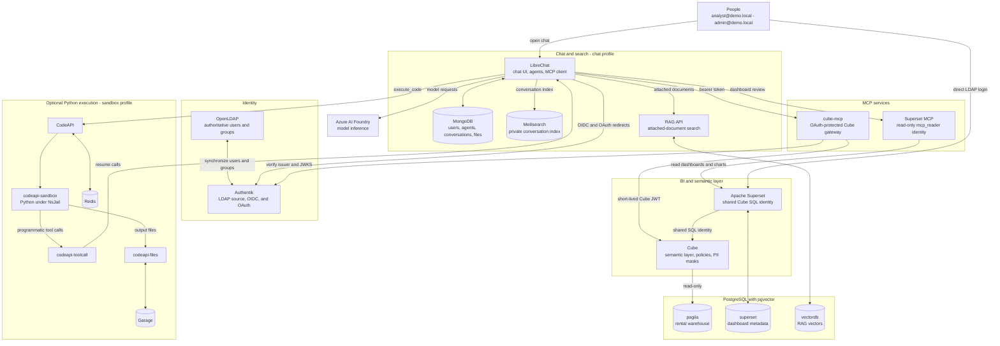
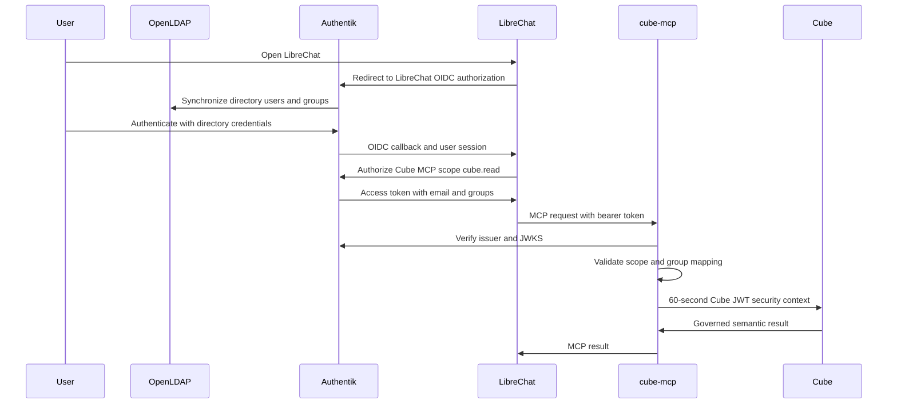

# On-Prem Agentic BI

A local Agentic BI demonstration built with Docker Compose. It combines a
Pagila warehouse, Cube semantic layer, Superset dashboard, LDAP-backed
Authentik SSO, LibreChat agents, and optional isolated Python execution.

Azure AI Foundry is the only intended external dependency and egress path for
model inference.

## Identity and authorization

OpenLDAP is the authoritative directory. Authentik synchronizes the LDAP users
and `analysts` and `admins` groups. LibreChat authenticates through Authentik
OIDC, while Superset continues to authenticate directly against LDAP.

LibreChat's `cube` MCP connection obtains an OAuth access token for the signed-in
user. `cube-mcp` verifies that token against Authentik's JWKS, requires the
`cube.read` scope, maps exactly one LDAP group to a role, and mints a short-lived
Cube JWT. Cube applies the matching view policy and masks PII before returning a
result. Unknown or ambiguously grouped users are denied.

LibreChat's `cube_sql` MCP connection validates the same OAuth token and sends
the same short-lived signed Cube context through a Cube SQL connection.

Superset is deliberately different: its dashboard and built-in MCP service use
one fixed Cube SQL identity. Superset users do not receive an individual Cube
security context.



## Services

| Area | Components | Purpose |
|---|---|---|
| Identity | OpenLDAP, Authentik | LDAP is the source of users and groups; Authentik provides LibreChat OIDC and Cube MCP OAuth. |
| BI | PostgreSQL, Cube, Superset | Pagila data, governed semantic views, and the dashboard. |
| Chat | LibreChat, MongoDB, Meilisearch, RAG API | Chat, per-user agents, conversation search, and attached-document search. |
| Agent tools | `cube-mcp`, `cube-sql-mcp`, `superset-mcp` | Governed Cube REST and Semantic SQL queries plus read-only dashboard inspection. |
| Optional sandbox | CodeAPI, NsJail sandbox, Redis, Garage | Python calculations, plots, and file delivery. |

`cube-mcp` is the only service allowed to call Cube's REST API. Cube REST is not
published on the host. `cube-sql-mcp` is the only agent service allowed to call
Cube's PostgreSQL endpoint, which also remains available for Superset and local checks.

## Authentication and authorization flow



## Quick start

1. Create local secrets and set the Azure Foundry values in `.env`.

   ```bash
   bash ./scripts/general/gen-secrets.sh --apply --force
   ```

   Set `AZURE_FOUNDRY_BASE_URL`, `AZURE_FOUNDRY_API_KEY`, and
   `AZURE_FOUNDRY_MODEL`. Keep `.env` local and do not rotate stable secrets on a
   running installation.

2. Bootstrap the full demonstration.

   ```bash
   bash ./bootstrap.sh
   ```

   Bootstrap clones pinned upstream sources, applies the LibreChat OIDC patch,
   builds images, starts profiles, initializes LDAP and storage, and runs checks.
   The initial sandbox build can take 20-45 minutes.

For a managed targeted startup after bootstrap, use the lifecycle helper. It
starts the base stack and runs the required safe initializers for each profile.

```bash
bash ./scripts/deployment/up.sh
bash ./scripts/deployment/up.sh --profile chat --profile sandbox
bash ./scripts/deployment/status.sh --profile chat --profile sandbox
```

For manual targeted startup:

```bash
docker compose up -d
docker compose --profile chat up -d
docker compose --profile sandbox up -d
```

The `chat` profile includes Authentik, LibreChat, both MCP services, RAG API,
MongoDB, and Meilisearch. The `sandbox` profile is optional. Use `cubestore` only
when testing Cube pre-aggregations.

## Sign in and use the agents

Open LibreChat at `http://localhost:3080`. It redirects to Authentik; sign in
with the LDAP account's full email address and password, such as the local demo
analyst account configured in `.env`. A successful first OIDC login creates that
person's managed agents automatically.

| Agent | MCP server | What it does |
|---|---|---|
| Agentic BI Analyst | `cube` | Discovers governed views and runs structured Cube semantic queries. It can calculate or chart results with the optional code tool. |
| Dashboard Reviewer | `superset` | Reads existing Superset dashboards, charts, and chart data. It cannot write dashboards or execute arbitrary SQL. |

The analyst always uses the logged-in user's OAuth identity. An analyst-group
user receives masked PII; an admin-group user receives the admin policy. The
agent does not accept a role, database credential, or user identity from the
prompt.

## Operator endpoints

Host ports come from `.env`; the defaults are shown below.

| Surface | URL | Notes |
|---|---|---|
| LibreChat | `http://localhost:3080` | OIDC through Authentik. |
| Authentik | `http://localhost:9000` | OIDC provider and LDAP synchronization. |
| Superset | `http://localhost:8088/superset/dashboard/agentic-bi/` | Direct LDAP login; fixed Cube identity. |
| Cube MCP | `http://localhost:8003/mcp` | OAuth-protected MCP endpoint. |
| Cube SQL MCP | `http://localhost:8004/mcp` | OAuth-protected Cube Semantic SQL endpoint. |
| Superset MCP | `http://localhost:5008/mcp` | Internal agent integration; read-only `mcp_reader` service identity. |
| RAG API | `http://localhost:8000/docs` | Local API reference, not a user UI. |

OpenLDAP, MongoDB, Meilisearch, Cube REST, and the internal Cube MCP endpoint
are not public host services.

## Governance model

Cube security is enforced by `config/cube/cube.js` and the view definitions in
`config/cube/model/views/`.

- LDAP `analysts` maps to Cube `analyst` and LDAP `admins` maps to Cube `admin`.
- A missing identity, missing group claim, or membership in both groups maps to
  `denied`.
- `CUBE_USER_ROLE_MAP` remains only for Cube SQL identities such as Superset;
  it does not determine LibreChat MCP access.
- PII masks live on cubes; access policies live on views.
- Keep `CUBE_MODE=demo`. `dev` disables Cube member-level access control.
- Query only semantic views and members returned by `get_schema`; raw SQL is not
  available through `cube-mcp`.
- `cube-sql-mcp` accepts only read-only Semantic SQL against visible views; agents should use an explicit `LIMIT` for exploratory or row-level queries.

The Superset exception is intentional. Superset is useful for a shared governed
dashboard, but it does not pass each dashboard user's identity into Cube.

## Operations and validation

```bash
docker compose config -q
docker compose ps
```

After Cube model, role, mask, access-policy, or cross-service changes, validate
the affected authorization and MCP behavior in your deployment workflow; a
healthy container alone is not sufficient.

To repair directory data, run `bash ./scripts/services/ldap/init.sh`. Normal
first LibreChat login provisions each user's managed agents automatically.

For a reset of local state:

```bash
docker compose --profile chat --profile sandbox down -v
```

This removes volumes and therefore deletes local data, identities, chats, and
dashboard metadata.

## Important limitations

- Superset and Superset MCP use a shared Cube identity, not per-user Cube
  authorization.
- The local demonstration uses LDAP without TLS and MongoDB without authentication
  on the private Compose network.
- Code execution uses NsJail and shares the host kernel.
- The seeded Pagila category relationship is many-to-many. The Cube model selects
  one primary category per film so revenue-by-category remains additive.

See [docs/ARCHITECTURE.md](docs/ARCHITECTURE.md) for component flows and
[docs/TRAPS.md](docs/TRAPS.md) for operational failure modes.
