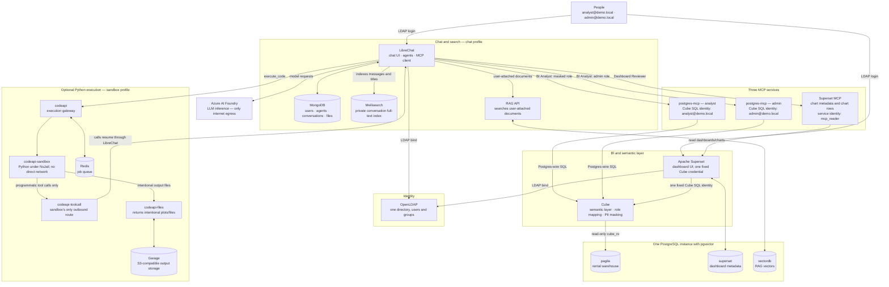

# On-Prem Agentic BI — Proof of Concept

An enterprise-shaped, fully on-premise agentic BI stack in one `docker compose`
project.

## Detailed architecture and data flow



Everything except Azure AI Foundry stays on the private Compose network. There is
one PostgreSQL server, not three: `pagila`, `superset`, and `vectordb` are separate
databases inside the same `pgvector` instance.

### Service clusters and purpose

| Cluster | Services | Purpose |
|---|---|---|
| Identity | OpenLDAP | One account and password per person for both LibreChat and Superset. It authenticates users; it does not decide Cube data access. |
| Chat | LibreChat, MongoDB, Meilisearch | LibreChat runs chat and agents. MongoDB is its durable state. Meilisearch privately indexes conversation titles and messages. |
| Document search | RAG API, `vectordb` | Searches only documents a user attaches in chat. Shared BI rules are in the agent system prompt, not RAG. |
| BI | Superset, Cube, `pagila`, `superset` DB | Superset renders the dashboard. Cube is the sole semantic-layer and warehouse path. |
| Agent execution | codeapi, sandbox, toolcall, Redis, Garage | Lets an agent calculate in Python and return a plot or file. The sandbox has no direct network access. |

### The three MCP services

MCP is the controlled tool interface LibreChat agents call. The two PostgreSQL MCP
containers have the same image and tools, but connect to Cube with different SQL
identities. Cube maps that identity to a role before returning data.

| MCP service | Used by | What it can reach | Governance consequence |
|---|---|---|---|
| `postgres-mcp-analyst` | Analyst-owned **Pagila BI Analyst** | Cube SQL API as `analyst@demo.local` | Cube returns masked customer PII. |
| `postgres-mcp-admin` | Admin-owned **Pagila BI Analyst** | Cube SQL API as `admin@demo.local` | Cube returns unmasked values for the demo admin role. |
| `superset-mcp` | Both **Dashboard Reviewer** agents | Superset charts, dashboards, and chart rows as `mcp_reader` | Read-only existing-dashboard access. It has no per-user identity; Superset uses one fixed Cube credential. |

The first two demonstrate semantic-layer masking. They are intentionally **not** a
production authorization design: the Cube role follows the agent's MCP container,
not the human who is logged in. The reviewer MCP is identical for both users because
Superset 6.1.0 does not pass a caller identity to its MCP service.

### Data-flow examples

**A governed BI question.** LibreChat selects the owner's Pagila BI Analyst, which
uses the matching PostgreSQL MCP server. That MCP server sends SQL to Cube; Cube
maps the fixed SQL identity to a role, masks before reading `pagila`, and returns
only permitted rows. For calculations or charts, the agent calls `execute_code`.
Python runs in the network-isolated sandbox and tool calls return through
`codeapi-toolcall` and LibreChat.

**A dashboard review.** The Dashboard Reviewer uses `superset-mcp` to list a
dashboard, inspect its chart definition, and read chart rows. It cannot execute
arbitrary SQL or modify Superset.

**A document or chat search.** An attached document is embedded locally by the RAG
API into `vectordb`. Separately, LibreChat indexes conversation titles and messages
in Meilisearch. These are distinct systems: RAG is for user files; Meilisearch is
for the user's chat history.

## Quick start

```bash
cp .env.example .env
./bootstrap.sh
```

`bootstrap.sh` vendors the three upstream sources, verifies/fills any remaining
placeholder secrets, builds the images, and brings the tiers up in order. Set
`AZURE_FOUNDRY_API_KEY` in `.env` when it warns, then re-run — it is idempotent.

Or by hand:

```bash
docker compose up -d                        # postgres + cube + superset
docker compose --profile sandbox up -d      # python execution
docker compose --profile chat up -d         # MCP servers + rag-api + Meilisearch + LibreChat
./scripts/init-ldap.sh                      # create/repair the LDAP tree
./scripts/migrate-librechat-ldap.sh         # Before first LDAP login
./scripts/provision-agent.sh                # 2 agents per user + embed business rules in prompts
./scripts/verify.sh                         # full verification suite
```

The first run compiles CPython for the sandbox (20–45 min, once) and builds
`rag_api` with torch for local embeddings.

| Surface | URL | Credentials |
|---|---|---|
| Superset dashboard | http://localhost:8088/superset/dashboard/agentic-bi/ | `admin@demo.local` / `DEMO_ADMIN_PASSWORD` |
| LibreChat | http://localhost:3080 | `analyst@demo.local` / `DEMO_ANALYST_PASSWORD` |
| RAG API reference | http://localhost:8000/docs | Local-only FastAPI/Swagger reference for `file_search`; not a user dashboard |
| Cube SQL API | `psql -h localhost -p 15432 -U analyst@demo.local -d cube` | `CUBEJS_SQL_PASSWORD` |
| Cube REST | http://localhost:4000 | JWT signed with `CUBEJS_API_SECRET` |
| OpenLDAP | *no published port* — internal only | `LDAP_ADMIN_DN` / `LDAP_ADMIN_PASSWORD` |

**One credential per person, for both front doors.** Log in with the full e-mail
address. There is deliberately no separate Superset password: `admin@demo.local`
is one identity and one row in `ab_user`.

## What the demo shows

Two users in **one userstore** — OpenLDAP — shared by Superset and LibreChat.
`CUBE_USER_ROLE_MAP` in `.env` decides masking, keyed on that same e-mail and read
by `config/cube/cube.js`.

| Login | Cube group | `customers_email` | `customers_full_name` | `addresses_phone` |
|---|---|---|---|---|
| `analyst@demo.local` | `analyst` | `***@sakilacustomer.org` | `M. S.` | `***-***-123` |
| `admin@demo.local` | `admin` | real | real | real |
| anything else | `denied` | *view not even visible* | | |

Fail-closed is a property of the design rather than a rule someone has to
remember: `denied` is the default branch in `contextToGroups`, and it appears in
**no** `access_policy` — Cube denies every group without a policy, so there is no
deny rule to forget.

### The two agents

| Agent | Reaches | Job |
|---|---|---|
| **Pagila BI Analyst** | Cube's SQL API via `postgres-mcp` | Write SQL against the semantic layer, compute in Python, plot. Masking differs per owner. |
| **Dashboard Reviewer** | Superset's own MCP service | Read the charts that already exist, reconcile them against the KPI tiles, and say what is misleading. Identical for both owners. |

Both retain `file_search` for documents attached by the user. Compact shared BI
rules from `config/librechat/system-rules.md` are embedded in their system prompts
during provisioning, so those rules are always available.

### Demo script

1. **Superset** — governed dashboard. The customer e-mail column is already
   masked; nothing in Superset is doing that.
2. **LibreChat as `analyst@demo.local`** — *"Plot monthly revenue by store for the
   last 12 months."* The agent discovers the model, queries the semantic layer
   from inside Python, and plots. Then ask for customer e-mails: masked.
3. **Switch to the admin's agent** — same question, same agent definition, **real
   e-mails**. No configuration changed; the semantic layer decided.
4. **Dashboard Reviewer** — *"Read the revenue dashboard and reconcile the charts
   against the KPI tiles."* It reads the real rows behind each chart and reports
   what does not add up. This is how the category fan-out below was found.
5. **Ask either agent a definition question** — *"What counts as an active
   customer?"* It answers from its compact system rules, not the data.
6. Optional: `psql -U nobody@nowhere.test` — denied, not escalated.

> **Say this out loud when demoing: LDAP unifies LOGIN, not authorization.** Both
> apps authenticate against one directory — that part is real. But Superset holds
> a single Cube credential, and an agent's Cube role comes from *which MCP
> container it is wired to*. Signing in as a different LDAP user changes neither.
> See [Security posture](#security-posture) below.

## Layout

```
docker-compose.yml    one stack; profiles: (default) | chat | sandbox | cubestore
bootstrap.sh          first-run driver: vendor -> secrets -> build -> up -> verify
config/               service config read by containers at runtime  (see its README)
docker/               our three Dockerfiles                         (see its README)
scripts/              host-side bash: init, provisioning, verify    (see its README)
docs/                 ARCHITECTURE.md, TRAPS.md                     (see its README)
vendor/               LibreChat, code-interpreter, rag_api — built from source, gitignored
```

Everything in `vendor/` is **built from source**, not pulled: the premise is that
the code is editable. Two of the three needed a replacement Dockerfile to build at
all — see [`docker/README.md`](docker/README.md).

## Six traps worth knowing up front

The full list is in [`docs/TRAPS.md`](docs/TRAPS.md). What they have in common is
that **each one fails in a way that looks like something else** — which is why
they are documented rather than merely fixed.

| Trap | How it presents |
|---|---|
| `CUBEJS_DEV_MODE=true` disables member-level access control | Masking silently shows **real PII**. No error. `CUBE_MODE=demo` for anything you show anyone; `verify.sh V1` asserts it |
| `public.film_category` is many-to-many (2367 rows / 1000 films) | Revenue by category over-reports by ~2.37× — `159539.15` against a true `67416.51`. **16 plausible bars, no error, no warning.** Cube and hand-written SQL produce the inflated number identically, because it is what the join says. `verify.sh V1b` reconciles the breakdown against the total |
| Superset 6.1.0 reads a `RECAPTCHA_PUBLIC_KEY` it never defines | `GET /login/` returns 500 — **the login page will not render at all** — while `/health` stays 200, the container stays `healthy`, and the JSON login API keeps working. Every API-only check passes while no human can sign in |
| Garage < v2.x: minio-js cannot parse `CompleteMultipartUpload` | Bytes land in the bucket, the client throws, and **every generated plot silently never reaches the user**. No error anywhere a user or healthcheck can see. Fixed by the v2.3.0 upgrade; `verify.sh V15` now asserts a real round trip |
| `CODEAPI_AUTH_PROVIDER=librechat-jwt` without key material | Throws at **tool-execute time, not startup**, so every container stays healthy while the agent loses `execute_code` and — the Cube tools being `code_execution`-only — all data access |
| `printf … \| grep -q` under `set -o pipefail` returns 141 | `grep -q` closes the pipe on first match, so a check fails **precisely when its pattern matches early**, which reads as a real regression |

## Security posture

Be honest with stakeholders about all of this.

- **The agent's Cube role is bound to the MCP container, not the signed-in
  person.** Two `postgres-mcp` containers run the *same image with the same
  flags*, differing only in the SQL username. That is what makes the masking
  contrast honest — any difference in output is the semantic layer's doing. But it
  also means whoever is handed the admin agent gets admin data. It is a
  demonstration prop, not governance. Production must bind the role to the
  authenticated identity; Cube already supports that via `securityContext`, and
  the gap is entirely on the client side.
- **Superset holds one Cube credential**, so every Superset user shares one
  security context. `DASHBOARD_RBAC` is deliberately off rather than implying
  per-user masking this path cannot deliver.
- **Superset's MCP service has no per-user identity at all** in 6.1.0. Every call
  runs as `mcp_reader`, so that account's role is the whole boundary — read-only
  and deliberately without `can_execute_sql_query`. `verify.sh V21` asserts the
  refusal from outside.
- **NsJail shares the host kernel.** `/dev/kvm` does not exist in Docker Desktop,
  so the libkrun microVM path is unavailable. Upstream's own words: appropriate
  for local development, *not* for executing untrusted code.
- **OpenLDAP is `osixia/openldap:1.5.0`** — OpenLDAP 2.4.57, an upstream-EOL
  series. It is the de-facto standard image, but its newest stable tag is from
  2021. Mitigation: **no port is published**. Do not carry it into production.
- **LDAP runs without TLS** and **MongoDB runs `--noauth`**, both reachable only
  on the compose network. Enable both beyond a PoC.
- **`LOCAL_MODE=true` on codeapi** skips its JWT handshake, so code sessions
  bucket under one principal. Authorisation is enforced in Cube, not here.
- **Embeddings are computed locally** on CPU, so document text never leaves the
  host — which is what lets the "only LLM inference leaves the host" claim survive
  adding RAG.

## Data notes

Pagila, vendored from [devrimgunduz/pagila](https://github.com/devrimgunduz/pagila)
at commit `5ba5a57aeb159f75f02aca2432d3c262186d13d3`. `30-date-shift.sql`
relocates the all-2022 data into the trailing months so relative-date filters are
not empty.

Measured properties that shaped the design:

- **`rental_date` and `payment_date` are independently generated**, needing
  different shifts (1425 vs 1462 days). 51 % of rentals postdate the last payment,
  and rentals have no rows at all in two consecutive months — so every revenue
  trend is built on `payments.paid_at`. A line chart on `rented_at` renders a gap
  that looks like a broken pipeline.
- **The span is ~7.3 months and a shift cannot widen it.** A "stretch to 24
  months" variant is rejected: it multiplies every rental duration by ~3.2×,
  making the `avg_rental_duration_days` KPI a lie.
- **`customer.create_date` is a single constant** for all 599 rows — no signup or
  cohort chart is possible.
- **No lat/long anywhere in Pagila**, only place names. No map chart.
- **`film_category` is many-to-many** — the most dangerous property of this
  dataset. The semantic layer collapses it to one primary category per film, so a
  category figure means "revenue of films whose *primary* category is X", not
  "revenue of films tagged X". Only the first is answerable through the model.

Expected after seeding: 16 044 rentals, 16 049 payments, revenue **67 416.51** —
and revenue-by-category must sum to exactly that.

## Operations

```bash
# Iterate on the Cube data model with the Playground (masking OFF)
CUBE_MODE=dev  docker compose up -d --force-recreate cube
CUBE_MODE=demo docker compose up -d --force-recreate cube   # back to enforcing

# Rebuild the dashboard after editing config/superset/build_dashboard.py
docker compose exec superset python /app/build_dashboard.py

# After restarting cube, restart the MCP servers too: they pool connections to it
# and do not validate them on checkout, so the first reused socket fails.
docker compose restart postgres-mcp-analyst postgres-mcp-admin

# Full reset, including data
docker compose --profile chat --profile sandbox down -v
```

`SUPERSET_SECRET_KEY` and `CUBEJS_API_SECRET` must stay **stable**: the first
encrypts Superset's stored DB credentials (rotating it is not self-healing), the
second signs Cube's REST API JWTs.

Deeper detail — every container, what it does, how to inspect it, and the
rejected alternatives — is in [`docs/ARCHITECTURE.md`](docs/ARCHITECTURE.md).
