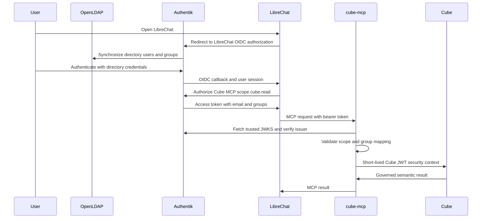

# Architecture

## Scope

This is a local demonstration stack. Docker Compose runs the directory, data
store, semantic layer, dashboard, chat application, and optional code sandbox.
Azure AI Foundry is used only for model inference. No database or MCP service is
intended to be reachable from the internet.

## Profiles

| Profile | Services | Purpose |
|---|---|---|
| default | OpenLDAP, PostgreSQL, Cube, Superset | Directory, warehouse, semantic layer, and dashboard. |
| `chat` | Authentik, Cube MCP, LibreChat, MongoDB, Meilisearch, RAG API, Superset MCP | OIDC login, agents, document/chat search, and MCP tools. |
| `sandbox` | CodeAPI, sandbox, Redis, Garage, file and tool-call services | Optional Python execution and output delivery. |
| `cubestore` | CubeStore | Optional Cube pre-aggregations. |

`docker-compose.yml` is the source of truth for containers, mounts, profiles,
ports, and dependencies.

## Identity flow



OpenLDAP is authoritative. Authentik's LDAP source synchronizes people and the
`analysts` and `admins` groups. LibreChat uses Authentik OIDC. Superset is a
separate LDAP client, so it authenticates directly with the same LDAP account.

The Authentik Cube provider must sign tokens with its internal JWT certificate.
`cube-mcp` verifies the provider's public JWKS and therefore rejects unsigned,
HS256-only, invalid-issuer, missing-scope, and expired tokens.

## Cube authorization

`docker/cube-mcp/app.py` is the chat-side authorization gateway.

1. It requires an Authentik bearer token with `cube.read`.
2. It reads `sub`, `email`, and `groups` from verified claims.
3. It maps exactly one of `analysts` or `admins` to the Cube role.
4. It issues a 60-second JWT containing `securityContext` to Cube REST.
5. Cube applies `contextToGroups`, view `access_policy`, and cube `mask` rules.

The gateway fails closed. Missing claims, no matching group, or membership in
both mapped groups produces no usable Cube context. Neither prompts nor agent
records can choose the Cube role.

`CUBE_USER_ROLE_MAP` remains the mapping for Cube SQL authentication, including
the shared Superset identity and operator checks. It is not consulted for the
OAuth REST path.

Cube REST on port 4000 is private to the Compose network. The gateway is the only
chat service with `CUBEJS_API_SECRET`. The host-visible Cube PostgreSQL endpoint
is retained for Superset and operator verification, not LibreChat agents.

### Semantic model

`config/cube/model/` contains cubes and views. Agents query only the views and
members returned from `get_schema`:

| View | Use |
|---|---|
| `revenue_analytics` | Revenue and payment questions. |
| `rental_analytics` | Rental volume, duration, and open-rental questions. |
| `customer_analytics` | Customer value and behavior. |
| `film_performance` | Catalogue and film performance. |
| `store_performance` | Store-level operations. |

Analyst policies mask the configured customer and staff PII. Admin policies allow
the configured members. The model defaults to `denied`; no view policy grants
that group access.

Keep `CUBE_MODE=demo` for any shared demonstration. `CUBE_MODE=dev` enables
Cube development mode and disables member-level access control.

## Chat and agent flow

LibreChat stores users, agent records, conversations, and uploads in MongoDB.
Meilisearch indexes private conversation metadata. RAG API stores vectors for
user-attached documents in the `vectordb` PostgreSQL database.

The LibreChat OIDC callback provisions managed agents after a user's first
successful login. It does not create a directory user or bypass Authentik.

| Agent | Tool server | Access model |
|---|---|---|
| Agentic BI Analyst | `cube` | OAuth token for the current LibreChat user; per-user Cube policy. |
| Dashboard Reviewer | `superset` | Read-only Superset service account; no per-user Cube context. |

The agent instructions require action before routine clarification, use structured
Cube queries rather than SQL, and do not ask users for tokens, credentials, or
curl output.

## Superset path

Superset authenticates against OpenLDAP. Its metadata database, dashboard assets,
and the demo dashboard are provisioned during container startup.

Superset connects to Cube with `SUPERSET_CUBE_SQL_USER`, which defaults to the
analyst SQL identity. The dashboard therefore uses a shared, masked context for
all Superset users. This is intentionally not an SSO-to-Cube pass-through path.

`superset-mcp` runs Superset's built-in MCP service. It always acts as the
read-only `mcp_reader` service account. It can inspect existing dashboard and
chart data but must not execute arbitrary SQL or modify Superset objects.

## Data path

One PostgreSQL instance hosts separate databases:

| Database | Use |
|---|---|
| `pagila` | Seeded DVD-rental warehouse. |
| `superset` | Superset metadata. |
| `vectordb` | RAG API vectors. |

Cube connects to Pagila as the read-only `cube_ro` database user. The primary
category model intentionally selects one category per film, preventing the
Pagila many-to-many category bridge from over-counting revenue.

## Optional code execution

CodeAPI sends Python work to an NsJail sandbox. Redis coordinates jobs, Garage
stores intended output files, and the tool-call service is the sandbox's
controlled route for resuming LibreChat tool calls. The sandbox has no direct
network route.

`CODEAPI_AUTH_PROVIDER=none` is deliberate for this local CodeAPI integration.
Changing it to a JWT mode without the corresponding key material breaks tool
execution after startup.

## State and recovery

| State | Volume or service | Recovery consideration |
|---|---|---|
| LDAP users and groups | `ldap_data`, `ldap_config` | Run `scripts/services/ldap/init.sh` to reconcile seeded entries. |
| Authentik configuration | Authentik PostgreSQL and media volumes | Blueprints create the LDAP source and OAuth providers on a fresh state. |
| Chat users and agents | MongoDB volume | First OIDC login provisions agents. |
| Superset dashboard | Superset home and PostgreSQL | Do not rotate `SUPERSET_SECRET_KEY`. |
| Warehouse and vectors | PostgreSQL volume | `initdb.d` only runs on a new volume. |

Removing volumes with `docker compose down -v` deletes this local state. Stable
secrets must remain stable when preserving volumes.

## Validation

Use these checks after changes:

```bash
docker compose config -q
docker compose ps
```

Validate authorization, OAuth, LDAP, and Superset MCP behavior after changes.
See [TRAPS.md](TRAPS.md) for expected failure patterns.
